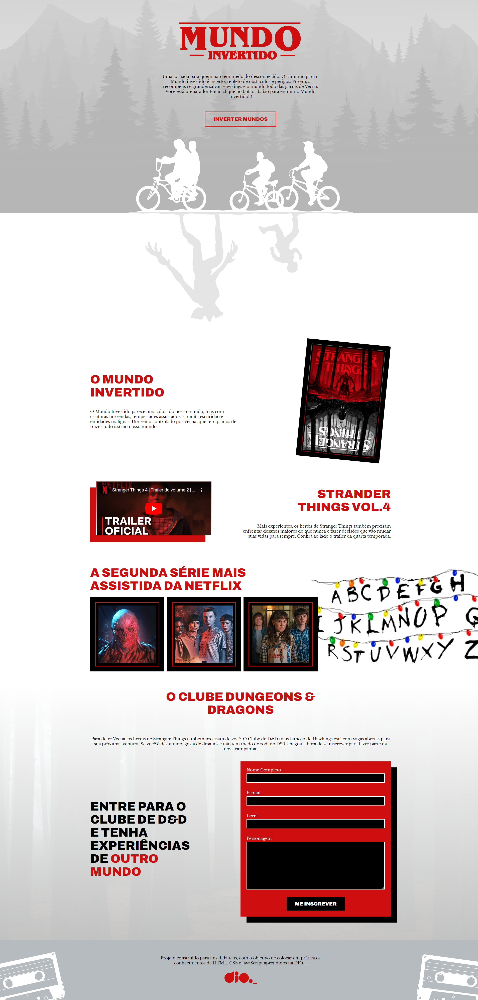

  

Construindo um Landing Page com HTML CSS e JS

<h2 id="tecnologias"> 💻 Tecnologias</h2>

- HTML
- CSS
- JavaScript

<h2 id="assuntos"> 💬 Assuntos abordados</h2>

- HTML
    - Estruturação da página 
    - Semântica
    - Acessibilidade
    - Web Scraping
    - SEO

- CSS
    - Posicionamentos
    - Pseudo-elementos
    - Pseudo-classes
    - Flexbox
    - Animações 

- JavaScript
    - Introdução ao JavaScript
    - Manipulação do DOM
    - Introdução ao Firebase
    - Integração com o Firebase

<h1 align="center" id="imagens">Tela de Inicio</h1>

<h4 align="right"><a href="#inicio">Inicio</a></h4>

<h4 align="right"><a href="#inicio">Inicio</a></h4>

